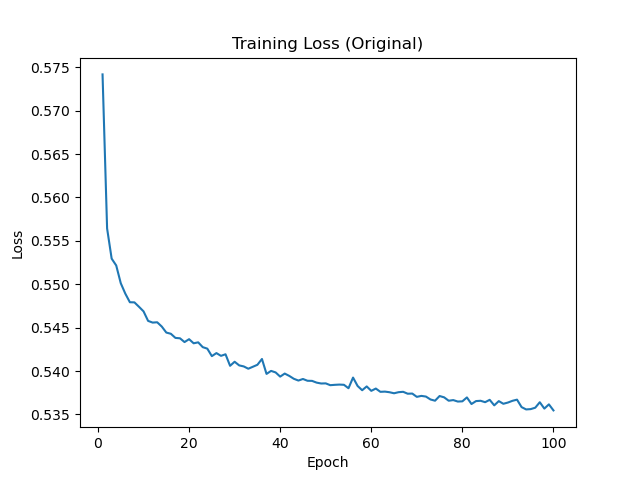
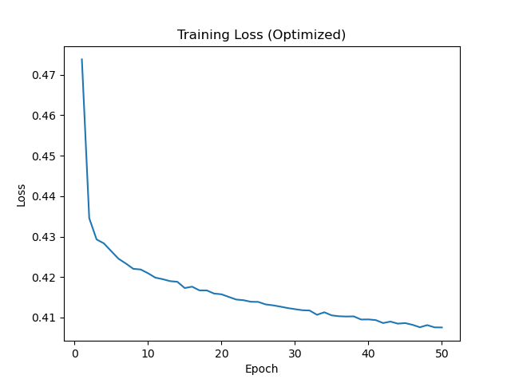
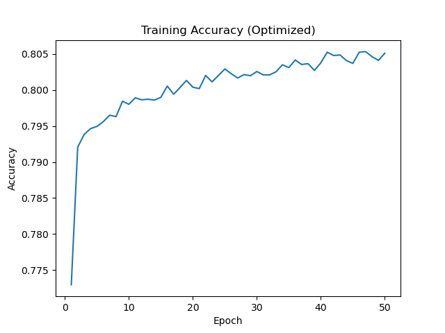

# deep-learning-challenge
This project uses deep learning neural networks to select funding applicants with the highest chances of success for a fictional non-profit. 

## Analysis

By utilizing the names of the applicants in the analysis and adjusting the classifications to 500 and number of epochs to 50, we were able to achieve accuracy of 0.79 and loss of 0.45, within the target range of greater than 0.75 and less than 0.45, respectively. 

## Charts

_Loss Original_

_Loss Optimized_

_Accuracy Optimized_

_Accuracy Optimized_